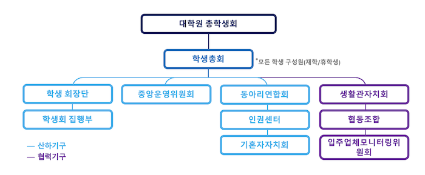

KAIST 대학원 총학생회 중앙운영위원회 신입위원 가이드라인
===

<!-- 되도록 링크로 빼고 내용에는 간소함을 유지할 것! -->
## 1. 대학원 총학생회(원총)의 설립 근거 

### (1) 원총에 대한 기본 설명
- KAIST 대학원 총학생회는 **(1) 대학원생의 권리를 보호**하고 **(2) 대학원생의 복지를 향상**하기 위해 구성된 학생 자치단체입니다. 

### (2) 한국과학기술원 대학원 학생회칙
- [한국과학기술원 대학원 학생회칙 바로가기](https://github.com/kaistgsa/organization-bylaw/blob/main/한국과학기술원-대학원-학생회칙.md)
- 원총 활동의 모든 기반이 되는 규정

### (3) KAIST 대학원 총학생회 조직 구성
- [한국과학기술원 대학원 학생회칙](https://github.com/kaistgsa/organization-bylaw/blob/main/한국과학기술원-대학원-학생회칙.md) 상의 총학생회 구조

    > 제1장 총칙  
    > 
    > 제1조 (명칭) 본회는 한국과학기술원 대학원 총학생회라 칭한다.  

    > 제5조 (구성) 본회는 제2조의 목적을 달성하기 위하여 학생총회와 3개의 협력기구(대학원 생활관자치회, 카이스트 협동조합, 입주업체모니터링위원회), 그리고 아래의 6개 산하기구로 구성된다.  
    >   1. 중앙운영위원회(이하 중운위)  
    >   2. 학생회장단(학생회장, 부학생회장)  
    >   3. 학생회 집행부  
    >   4. 대학원 동아리연합회  
    >   5. 대학원생 인권센터  
    >   6. 대학원 기혼자자치회  

**참고**
> [한국과학기술원 대학원 학생회칙](https://github.com/kaistgsa/organization-bylaw/blob/main/한국과학기술원-대학원-학생회칙.md) 상 원총은 모든 KAIST 대학원 재학생/휴학생 등으로 구성된 단체를 의미하나, 일상적인 의미에서 원총은 학생회장단과 학생회 집행부원을 통칭함.

- KAIST 대학원 총학생회 조직도  

- 대학원 총학생회는 학생총회, 6개의 산하기구, 그리고 3개의 협력기구로 구성됩니다.  

    | 이름 | 줄임말 | 구분 | 설명 | 
    |:---:|:---:|:---:|---|
    | [**학생총회**](https://github.com/kaistgsa/organization-bylaw/blob/main/한국과학기술원-대학원-학생회칙.md#제2장-학생총회) | - | - | 대학원 총학생회 최고의결기관으로 대전 본원 소속의 석, 박사과정 학생(재학/휴학생)으로 구성됨. 학생총투표, 선거관리위원회 등을 포함 |
    | [**학생 회장단**](https://github.com/kaistgsa/organization-bylaw/blob/main/한국과학기술원-대학원-학생회칙.md#제4장-학생회장단) | - | 산하기구 |  학생회장, 부학생회장(한 명 혹은 두 명) |
    | [**학생회 집행부원**](https://github.com/kaistgsa/organization-bylaw/blob/main/한국과학기술원-대학원-학생회칙.md#제5장-집행부) | - | 산하기구 |  ⭐️최고집행기구⭐️ 학생회장, 부학생회장, 각부 부장 및 임원 |
    | [**중앙운영위원회**](https://github.com/kaistgsa/organization-bylaw/blob/main/한국과학기술원-대학원-학생회칙.md#제3장-중앙운영위원회) | 중운위 | 산하기구 |  학생총회의 결정권을 위임받을 수 있는 의결기구. 학생회장단, 학생 자치단체와 학과의 대표자들로 구성 |
    | [**대학원생 인권센터**](https://github.com/kaistgsa/organization-bylaw/blob/main/한국과학기술원-대학원-인권센터-회칙.md) | - | 산하기구 | 대학원생 학우들의 인권에 관련된 전반적인 사항들을 개선하기 위해 설립된 ⭐️학생 자치기구⭐️ |
    | [**대학원 동아리연합회**](https://github.com/kaistgsa/organization-bylaw/blob/main/한국과학기술원-대학원-동아리연합회-회칙.md) | 동연 | 산하기구 | 대학원생 동아리 활동을 할 수 있도록 재정적, 행정적 지원을 수행 |
    | [**기혼자자치회**](https://github.com/kaistgsa/organization-bylaw/blob/main/한국과학기술원-대학원-기혼자자치회-회칙.md) | 기자회 | 산하기구 | 결혼 생활 중이거나, 결혼에 관심이 있는 사람들이 모여 정보를 공유하고 협력하기 위해 설립된 학생 자치기구 |
    | [**대학원 생활관자치회**](https://github.com/kaistgsa/organization-bylaw/blob/main/대학원-생활관자치회-회칙.md) | 생자회 | 협력기구 | 대학원생 생활관에 거주하는 학생들의 권익을 대변하는 학생 자치기구 |
    | [**카이스트 협동조합**](https://github.com/kaistgsa/organization-bylaw/blob/main/카이스트-협동조합-정관.md) | 협동조합 | 협력기구 | 소비, 문화, 환경 등을 더 나은 것으로 가꾸기 위해 학교 구성원이 스스로 조직한 단체 (학부+대학원) |
    | [**입주업체모니터링위원회**](https://github.com/kaistgsa/organization-bylaw/blob/main/입주업체모니터링위원회-회칙.md) | 입모위 | 협력기구 | 교내 입주업체에 대한 학생 주도 평가와 계약에 대한 그 평가의 실질적 반영을 통해 업체들에 대한 학생들의 영향력을 높이고 업체 서비스 품질을 개선하는 학생 자치단체 (학부+대학원) |

## 2. 중앙운영위원회 위원의 역할

> 제3장 중앙운영위원회  
> 제16조 (지위) 중운위는 <b>학생총회의 결정권을 위임받을 수 있는 의결기구</b>로서 다양한 학생 자치단체와 학과의 대표자들로 구성되어 학내 제반 사항들을 논의한다.  
> 제20조 (업무 및 권한) 중운위는 다음과 같은 업무 및 권한을 가진다.  
>   1. 본회 활동의 기본 방향에 대한 심의 의결권  
>   2. 회칙 개정의 발의 및 의결권  
>   3. 각 자치단체의 업무 계획 및 결과 보고 심의권  
>   4. 학생총회 소집 요구권  
>   5. 학생회비 및 예산 결산의 심의 및 승인권: 감사를 위한 특별 조치를 필요로 할 때에는 각 학부 대표 1인씩으로 구성되는 특별위원회를 둘 수 있다.  
>   6. 학생회장단 및 집행부 각 국 국장, 부장, 인권센터장의 탄핵권  
>   7. 학사 운영과 학내 생활에 있어서의 중요한 사안에 대한 조치  
>   8. 집행부 각 국 국장, 부장의 총회 출석 요구권  
>   9. 각 자치 단체의 선거와 운영에 관련하여 제기되는 사항에 대한 심의 의결권  
>   10. 각 자치단체 및 특별기구의 운영 회칙에 대한 심의 의결권  

- 매 학기 2회 이상 개최 (매 학기 시작 전후 30일 이내). 
- 통상적으로 상반기(3 ~ 8월) 2회, 하반기(9 ~ 익년 2월) 3회 개최 
- 👉[중앙운영위원회 회의 기록](https://github.com/kaistgsa/CMCM)👈

## 3. 학과대표 중앙운영위원회 위원 간부장학금 지급 (작성일: 2022년 12월 8일)

<ol>
<li><b>학과대표 활동보고서 제출</b></li>
    <ol type="a">
    <li>평가기간 </li>
        <ol type="i">
        <li>상반기 지급 대상자</li>
            1.  매년 1월 1일 ~ 6월 30일
        <li>2. 하반기 지급 대상자</li>
            2. 매년 7월 1일 ~ 12월 31일
        </ol>
    <li>평가방법</li>
        3. 활동 보고서 제출 시 충족
    </ol>
<li><b>중앙운영위원회 참석 여부 충족</b></li>
    <ol type="a">
    <li>개인이 아닌 학과 참석 기준으로 참석 여부 확인</li>
        <ol>
        <li>학과별 학과대표 활동 기간이 상이하여 부득이하게 학과를 참석 여부 충족 기준으로 정함.</li>
        </ol>
    <li>평가기간</li>
        <ol type="i">
        <li>상반기 지급 기준</li>
            1. 학과 대표의 하반기 2차 중운위 참석 (2월 개회)
            2. 학과 대표의 하반기 3차 중운위 참석 (2월 개회)
        <li>하반기 지급 기준</li>
            1. 학과 대표의 상반기 1차 중운위 참석 (7월 개회)
            2. 학과 대표의 상반기 2차 중운위 참석 (8월 개회)
            3. 학과 대표의 하반기 1차 중운위 참석 (12월 개회)
        </ol>
    <li>참고</li>
        <ol type="i">
            <li>불성실한 태도로 회의 참여 시 경고 조치. 반기 당 학과대표(대리인 포함) 경고 3회 누적 시 불참으로 간주</li>
            <li>사전 통지 없이 자리 비움</li>
            <li>허위 참석</li>
            <li>온라인 회의 시 10분 이상 카메라 오프</li>
            <li>회의 중 다른 업무</li>
        </ol>
    <li>평가방법</li>
        <ol type="i">
            <li>각 반기별 1회 이상 불참할 경우, 해당 학과 간부장학금 추천에서 제외</li>
            <li>각 반기별 1회 이하로 대리인을 선임할 경우, 해당 학과 간부장학금 추천</li>
            <li><b>각 반기별 2회 이상 대리인을 선임할 경우, 총학생회장단이 학과 대표 활동 보고서를 검토한 뒤 해당 학과의 추천 여부 결정 (단, 추천이 반려되었을 때 학과 대표는 1회 이의 제기 가능)</b></li>
         </ol>
</ol>

**FAQ**

**Q. 상반기(또는 하반기)에 학과대표가 교체되어 2인이 대상자가 되었습니다. 이럴 경우, 장학금 대상자는 누가 되나요?** 
A. 개인이 아닌 학과를 기준으로 수여하는 장학금이기 때문에, 학과에서 자체적으로 논의한 후 1인이 활동보고서를 제출하면 됩니다.

**Q. 활동보고서는 어떻게 작성하나요?** 
A. 간부장학금 추천 시기가 되면, 원총에서 활동보고서 양식을 배부합니다. 개인정보는 삭제되며, 분량과 내용은 학과에서 자율적으로 구성할 수 있습니다. [2021년 학과활동보고서](https://gsa.kaist.ac.kr/notice/207632)

**Q. 우리 학과는 학과대표와 부대표가 함께 활동하고 있습니다. 장학금 금액을 절반으로 나눠서 지급받을 수 있나요?** 
A. 실무를 담당하는 장학복지팀에서 1인당 예산으로 책정되어 있어 불가하다고 답변 받았습니다. 향후 지급 가능한 방안을 찾아보도록 하겠습니다.

